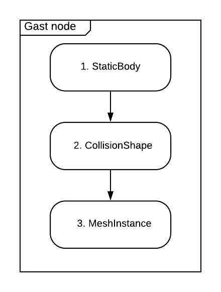

# Godot Android Streaming Texture (GAST) Plugin

This is a collection of Godot Android plugins that leverage
[Godot's support for OpenGL external textures](https://github.com/godotengine/godot/pull/36342)
to enable rendering and interaction with Android views in a Godot project's scenegraph.

**Note:** The plugins are only supported on the Godot **3.2.x** branch, starting with **version 3.2.2**.

## License

This project is released under the MIT license.

## Contributions

The project is in **alpha** state (base functionality is available but API is subject to change).
Contributions are welcomed!

### Setup

Clone the repository and **initialize the submodules** with `git submodule update --init --recursive`.
- **Note**: When you've pulled a newer version, make sure to run `git submodule update --init --recursive`.

#### Godot CPP library

- The `git submodule update --init --recursive` command should have checked out the
[godot-cpp repo](https://github.com/GodotNativeTools/godot-cpp) under the `core/libs/godot-cpp` directory.
- Navigate to the `core/libs/godot-cpp` directory and follow these steps:
  - Generate the `godot-cpp` bindings and static libraries with the following commands:
    - `scons platform=android generate_bindings=yes android_arch=arm64v8 target=release ANDROID_NDK_ROOT="/PATH-TO-ANDROID-NDK/"`
    - `scons platform=android generate_bindings=yes android_arch=arm64v8 target=debug ANDROID_NDK_ROOT="/PATH-TO-ANDROID-NDK/"`

**Note**: If you run into issues, check out the [repo setup instructions](https://github.com/godotengine/godot-cpp/tree/3.2#compiling-the-c-bindings-library).

### IDE

The project uses [Android Studio](https://developer.android.com/studio/intro) for development.
Make sure you have [Android Studio version 4.0 or higher](https://developer.android.com/studio) and
open the project within Android Studio.

## GAST Plugins

- [GAST-Video](core/src/plugins/java/org/godotengine/plugin/gast/plugins/video/README.md)
- [GAST-WebView](core/src/plugins/java/org/godotengine/plugin/gast/plugins/webview/README.md)

## Architecture

The GAST plugin is written in C++ and Kotlin.

The Kotlin layer leverages the [Godot Android Plugin framework](https://docs.godotengine.org/en/stable/tutorials/plugins/android/android_plugin.html)
to integrate with a Godot Android application. It provides the public APIs for Android clients to access the plugin core functionality in order to render, interact with and manipulate content generated by the Android View system in Godot’s scenegrah.

The core functionality is written in C++. It leverages the [Godot GDNative C++ bindings](https://github.com/godotengine/godot-cpp)
in order to access and use the [GDNative API](https://godotengine.org/article/dlscript-here).
Through that API, it’s able to access at runtime the project scenegraph and manipulate it by adding,
updating and/or removing Godot nodes and/or resources.

### GastNode

This is the element in the scenegraph responsible for rendering and supporting interaction with an
Android view.

#### Structure



A GastNode is made of the following Godot nodes and resources:

1. [StaticBody node](https://docs.godotengine.org/en/stable/classes/class_staticbody.html) as the
root node, which allows the GastNode to detect collision events (if enabled by the user).
2. A StaticBody node [requires](https://docs.godotengine.org/en/stable/tutorials/physics/physics_introduction.html#collision-shapes)
a [Shape resource](https://docs.godotengine.org/en/stable/classes/class_shape.html) to define the
object’s collision bounds. For the GastNode, we’re using a [CollisionShape node](https://docs.godotengine.org/en/stable/classes/class_collisionshape.html)
who's shape is set whenever the child's mesh is updated.
3. Since our GastNode is ultimately a mesh in 3D space, we make use of Godot’s [MeshInstance node](https://docs.godotengine.org/en/stable/classes/class_meshinstance.html)
to render the GastNode.

Once a GastNode is created, the client gains the ability to retrieve a [Surface](https://developer.android.com/reference/android/view/Surface)
instance via the [GastNode#bindSurface()](core/src/main/java/org/godotengine/plugin/gast/GastNode.kt#L81) API.
The Surface instance can be used as an output destination onto which Android Views, images or videos
can be rendered. This is the process used by the [GAST-Video](core/src/plugins/java/org/godotengine/plugin/gast/plugins/video/README.md)
and [GAST-WebView](core/src/plugins/java/org/godotengine/plugin/gast/plugins/webview/README.md) plugins.

#### Input Handling

Using the [GastInputListener interface](core/src/main/java/org/godotengine/plugin/gast/input/GastInputListener.kt)
via the [GastManager#registerGastInputListener(...)](core/src/main/java/org/godotengine/plugin/gast/GastManager.kt#L107)
and [GastManager#unregisterGastInputListener(...)](core/src/main/java/org/godotengine/plugin/gast/GastManager.kt#L127)
methods, the GastManager instance relays *interaction* events from the generated node(s) to the
client. This provides the client with enough information to generate and feed [Android MotionEvent](https://developer.android.com/reference/android/view/MotionEvent)
events to the Android view.

Two types of events are supported:

##### Input Events

The plugin uses the [Godot Input API](https://docs.godotengine.org/en/stable/tutorials/inputs/inputevent.html)
to subscribe to dispatched [input action events](https://docs.godotengine.org/en/stable/classes/class_inputeventaction.html)
(e.g: button press). It listens for the events registered by the client via the
[GastInputListener#getInputActionsToMonitor()](core/src/main/java/org/godotengine/plugin/gast/input/GastInputListener.kt#L48)
method, and notifies the client accordingly via the [GastInputListener#onMainInputAction(...)](core/src/main/java/org/godotengine/plugin/gast/input/GastInputListener.kt#L57) callback.


##### Collision Events

Godot’s [Physics API](https://docs.godotengine.org/en/stable/tutorials/physics/physics_introduction.html)
is used in order to detect collision events between the GastNode and a [ray cast](https://docs.godotengine.org/en/stable/classes/class_raycast.html)
from the input pointer (in VR the input pointer consists of a tracked controller/hand).
This is used to provide support for detecting *click*, *hover* and *scroll* events targeted at the GastNode.

These events are dispatched to the **GDScript** code via the following signals:

- `hover_input_event` for hover events
- `press_input_event` for click press events
- `release_input_event` for click release events
- `scroll_input_event` for scroll events

Similarly, the Android code can listen to these events using the corresponding methods:

- [GastInputListener#onMainInputHover(...)](core/src/main/java/org/godotengine/plugin/gast/input/GastInputListener.kt#L64) for hover events
- [GastInputListener#onMainInputPress(...)](core/src/main/java/org/godotengine/plugin/gast/input/GastInputListener.kt#L71) for click press events
- [GastInputListener#onMainInputRelease(...)](core/src/main/java/org/godotengine/plugin/gast/input/GastInputListener.kt#L78) for click release events
- [GastInputListener#onMainInputScroll(...)](core/src/main/java/org/godotengine/plugin/gast/input/GastInputListener.kt#L85) for scroll events

The dispatched events include the [nodepath](https://docs.godotengine.org/en/stable/classes/class_nodepath.html)
of the targeted Gast node, the [node name](https://docs.godotengine.org/en/stable/classes/class_node.html#class-node-property-name)
of the colliding ray cast and information specific to the type of the event (e.g: hover location for
a hover event).

Example code:

```
func _ready():
    ...
    var gast_loader = load("res://godot/plugin/v1/gast/GastLoader.gdns").new()
    gast_loader.initialize()
    gast_loader.connect("hover_input_event", self, "_on_gast_hover_input_event")
    gast_loader.connect("press_input_event", self, "_on_gast_press_input_event")
    gast_loader.connect("release_input_event", self, "_on_gast_release_input_event")
    gast_loader.connect("scroll_input_event", self, "_on_gast_scroll_input_event")
    ...

func _on_gast_hover_input_event(node_path: String, event_origin_id: String, x_percent: float, y_percent: float):
    pass

func _on_gast_press_input_event(node_path: String, event_origin_id: String, x_percent: float, y_percent: float):
    pass

func _on_gast_release_input_event(node_path: String, event_origin_id: String, x_percent: float, y_percent: float):
    pass

func _on_gast_scroll_input_event(node_path: String, event_origin_id: String, x_percent: float, y_percent: float, horizontal_delta: float, vertical_delta: float):
    pass
```

###### Collision Events Setup

A **couple of requirements must be followed** for the collision events handling to be properly set up.

1. The colliding raycast **must** belong to the **gast_ray_caster** [node group](https://docs.godotengine.org/en/stable/getting_started/step_by_step/scripting_continued.html#groups).
This allows to filter unwanted raycast collisions.
2. Since *click* and *scroll* events rely on additional input events (e.g: button press, joystick
tilt), the plugin monitors a set of [input action events](https://docs.godotengine.org/en/stable/classes/class_inputeventaction.html)
with the characteristics listed below. **It’s the responsibility** of the client to **declare
and register** the corresponding [input actions](https://docs.godotengine.org/en/stable/tutorials/inputs/inputevent.html?#actions)
in the Godot project.
   - The monitored input action prefix is generated by using the colliding raycast's [node name](https://docs.godotengine.org/en/stable/classes/class_node.html#class-node-property-name).
   - There is one input action per raycast for click events. It’s generated by appending the
   “**_click**” suffix to the input action prefix generated as described above.
     - E.g: click action event for a [RayCast](https://docs.godotengine.org/en/stable/classes/class_raycast.html)
     node with name **LeftRayCast** would be **LeftRayCast_click**
   - There are two input actions per raycast for horizontal scroll events. They are generated by
   appending “**_left_scroll**” for the left scroll events and “**_right_scroll**” for the right
   scroll events.
     - E.g: For a [RayCast](https://docs.godotengine.org/en/stable/classes/class_raycast.html) node with name **LeftRayCast**
       - Left scroll => **LeftRayCast_left_scroll**
       - Right scroll => **LeftRayCast_right_scroll**
   - There are two input actions per raycast for vertical scroll events. They are generated by
   appending “**_up_scroll**” for the up scroll events and “**_down_scroll**” for the down scroll
   events.
     - E.g: For a [RayCast](https://docs.godotengine.org/en/stable/classes/class_raycast.html) node
     with name **LeftRayCast**
       - Up scroll => **LeftRayCast_up_scroll**
       - Down scroll => **LeftRayCast_down_scroll**

## Performance Considerations

The GAST plugin attempts to recycle GastNodes as much as possible, only creating new ones if the
pool is empty or exhausted. This allows to keep a lid on the number of generated OpenGL external
textures.

